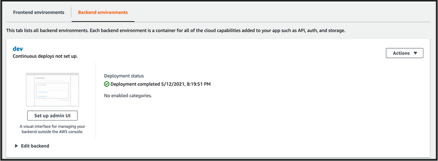
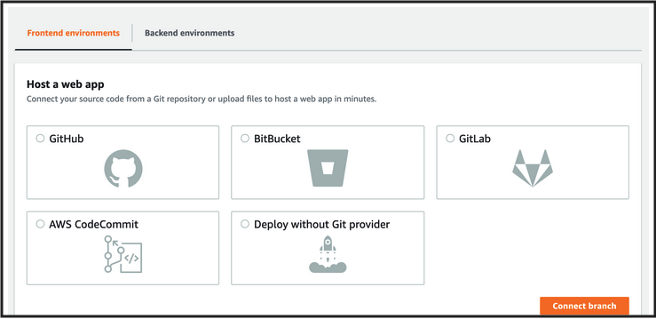
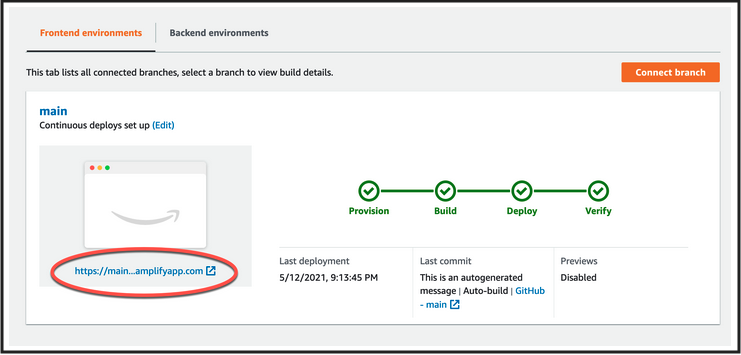

# REACTJS Web App

A sample web app to made using Contentful](https://www.contentful.com/) and [AWS Amplify](https://aws.amazon.com/amplify/). Data lives in Contentful, code lives with GitHub and backend lives in AWS. 


### Topics we'll be covering:

- [Authentication with Amazon Cognito](https://github.com/syumaK/amplify-contentful-app#adding-authentication)
- [CMS with Contentful](https://github.com/syumaK/amplify-contentful-app#adding-contentful)
- [Analytics with Amazon Pinpoint](https://github.com/syumaK/amplify-contentful-app#adding-analytics)
- [Hosting with Amazon Amplify console](https://github.com/syumaK/amplify-contentful-app#adding-hosting)
- [Removing / Deleting Services](https://github.com/syumaK/amplify-contentful-app#removing-services)

Getting started
=====

## Requirements

To deploy this project, you'll need the following:

- [AWS account](https://aws.amazon.com/resources/create-account/)
- [Contentful](https://www.contentful.com/sign-up/ )
- [Node JS](https://nodejs.org/en/)
- [Amplify CLI](https://docs.amplify.aws/cli/start/install)

# Usage

## Prepare working directory

Clone/Fork repository.

- git clone https://github.com/syumaK/amplify-contentful-app.git

Install dependencies.

- `yarn install`

OR

Create a new project using the [Create React App CLI](https://github.com/facebook/create-react-app).


```bash
npx create-react-app amplify-contentful-app
```

Now change into the new app directory & install the AWS Amplify & AWS Amplify React libraries:

```bash
cd amplify-contentful-app

yarn add aws-amplify @aws-amplify/ui-react
```

### `Installing Amplify CLI & Initializing the Backend`

Install the AWS Amplify CLI:

```bash
npm install -g @aws-amplify/cli
```

Now we need to configure the CLI with our credentials.

> If you'd like to see a video walkthrough of this configuration process, click [here](https://www.youtube.com/watch?v=fWbM5DLh25U).

```sh
$ amplify configure

- Specify the AWS Region: us-east-1 || us-west-2 || eu-central-1
- Specify the username of the new IAM user: amplify-cli-user
> In the AWS Console, click Next: Permissions, Next: Tags, Next: Review, & Create User to create the new IAM user. Then return to the command line & press Enter.
- Enter the access key of the newly created user:   
? accessKeyId: (<YOUR_ACCESS_KEY_ID>)  
? secretAccessKey: (<YOUR_SECRET_ACCESS_KEY>)
- Profile Name: amplify-cli-user
```

We’ll use the AWS Amplify CLI to initialize backend components such as authentication to support our app:

```bash
amplify init

- ? Enter a name for the project: foodblogamplifycontentful

The following configuration will be applied:
    
- Name: foodblogamplifycontentful 
- Environment: dev
- Default editor: Visual Studio Code
- App type : javascript
- Javascript framework: react
- Source Directory Path: src
- Distribution Directory Path: build
- Build Command: npm run-script build
- Start Command: npm run-script start

- ? Initialize the project with the above configuration? (Y/n)
Using default provider  awscloudformation
- ? Select the authorization method you want to use: (use arrow keys)
> AWS profile
> AWS access keys
```
The Amplify init command CLI initializes a new project & you will see a new folder: __amplify__ & a new file called __aws-exports.js__ in the root directory. These files hold your project configuration.

To view the status of the amplify project at any time, you can run the Amplify `status` command:

```sh
$ amplify status
```

### `Adding Authentication`

To add authentication to our web application, we can use the following command:

```sh
$ amplify add auth

? Do you want to use default authentication and security configuration? (Use arrow keys) 
> Default configuration
> Default configuration with Social Provider (Federation)
> Manual configuration
> I want to learn more.

```

Now, we'll run the `push` command and the cloud resources will be created in our AWS account.

```bash
amplify push
```
```bash
✔ Successfully pulled backend environment dev from the cloud.

Current Environment: dev

| Category | Resource name    | Operation | Provider plugin   |
| -------- | ---------------- | --------- | ----------------- |
| Auth     | foodblog9a5f7e3a | Create    | awscloudformation |
? Are you sure you want to continue? Yes
```

### `Configuring the React application`

Now, our resources are created & we can start using them!

The first thing we need to do is to configure our React application to be aware of our new AWS Amplify project. We can do this by referencing the auto-generated `aws-exports.js` file that is now in our src folder.

To configure the app, open __src/App.js__ and add the following code below the last import:

```js
/*
import amplify modules
*/

import Amplify from 'aws-amplify'
import config from './aws-exports'
Amplify.configure(config)
```

Now, our app is ready to start using our AWS services.

### `Using the withAuthenticator component`

To add authentication, we'll go into __src/App.js__ and first import the `withAuthenticator` HOC (Higher Order Component) from `@aws-amplify/ui-react`:

```js
// src/App.js, import the withAuthenticator component
import { withAuthenticator } from '@aws-amplify/ui-react'
```

Next, we'll wrap our default export (the App component) with the `withAuthenticator` HOC:

```js
function App() {/* existing code here, no changes */}

/* src/App.js, change the default export to this: */
export default withAuthenticator(App)
```

Next test it out in your browser:

```js
yarn start
```

Now, we can run the app and see that an Authentication flow has been added in front of our App component. This flow gives users the ability to sign up & sign in.

Once you sign up, check your email to confirm the sign up.

Now that you have the authentication service created, you can view it any time in the console by running the following command:

```js
amplify console auth

> Choose User Pool
```

### `Adding SignOut component`

You can also easily add a preconfigured UI component for signing out.

```js
import { withAuthenticator, AmplifySignOut } from '@aws-amplify/ui-react';

/* Somewhere in the UI */
<AmplifySignOut />
```

### `Adding Contentful`

First Contentful modules

```bash
yarn add contentful
```

To connect to contentful and render your contents, we need the following :

- import `contentful` package and `useState, useEffect` from `React` as shown below:

```js
import React, { useState, useEffect } from 'react';

/*
import contentful modules
*/

import * as contentful from 'contentful'
```

- initialize the contentful client as shown below:

```js
export const client = contentful.createClient({
    space: 'XX_XXXX_XXXXXX',
    accessToken: 'XX_XXXX_XXXXXX'
});
```

This repo currently uses an existing Contentful space. If you'd like to replace this space with your own, so you can modify the content, you're welcome to do so.


### `Adding Analytics`

To add analytics, we can use the following command:

```sh
amplify add analytics
```

> Next, we'll be prompted for the following:

? Provide your pinpoint resource name: __amplifyanalytics__   
? Apps need authorization to send analytics events. Do you want to allow guest/unauthenticated users to send analytics events (recommended when getting started)? __Y__   
? overwrite YOURFILEPATH-cloudformation-template.yml __Y__

#### `Recording events`

Now that the service has been created we can now begin recording events.

To record custom analytics events we need the following :

- import the `Analytics` class from Amplify as shown below:

```js
import Amplify, { Analytics } from 'aws-amplify'
```

- invoke `Analytics.record`as shown below:

```js
  // Button for events
  function submitEvents (){
    
    Analytics.record({
      name:'userVisit',
      attributes: { name : 'Stefan', location: 'CPT'}
    });
    
    Analytics.record({
      name:'siteVisit',
      attributes: { name : 'webinar', month: 'Nov'}
    });
  }

<button onClick={this.recordEvent}>Record Event</button>
```

### `Adding Hosting`

You've successfully built a React.js web app using Amplify and Contentful! Now it's time to deploy it to the web using AWS Amplify's CI/CD and hosting service!

From the root of your project, run the following command:


```js
amplify add hosting

? Choose Hosting with Amplify Console (Managed hosting with custom domains, Continuous deployment)
? Choose a type - Continuous deployment (Git-based deployments)
? Continuous deployment is configured in the Amplify Console. Please hit enter once you connect your repository
```
The Amplify Console opens and displays your deployed backend environment. 



Choose the Frontend environments tab, select a Git provider, then choose Connect Branch.



After your site is successfully deployed, you'll see four green checkmarks. To view the live site, click on the automatically generated URL circled in red in the following screenshot.



👏 Congratulations, your app is online!


### `Removing Services`

If at any time, or at the end of this workshop, you would like to delete a service from your project & your account, you can do this by running the `amplify remove` command:

```sh
amplify remove auth

amplify push
```

If you are unsure of what services you have enabled at any time, you can run the `amplify status` command:

```sh
amplify status
```

`amplify status` will give you the list of resources that are currently enabled in your app.